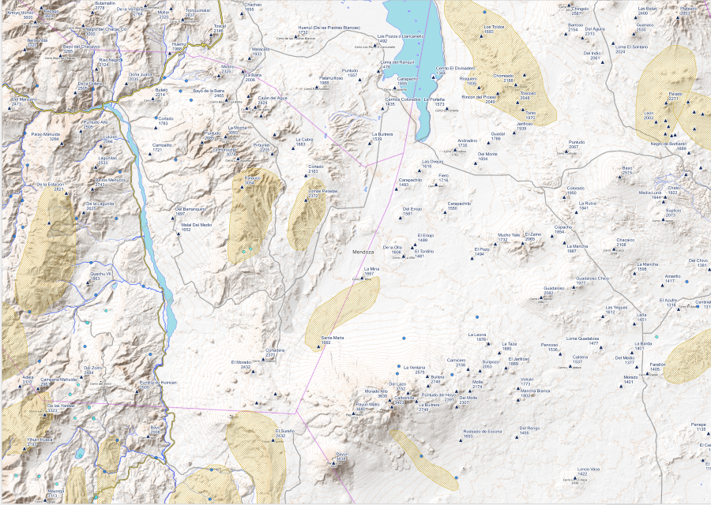

# Elementos:
1. [mountain_of_argentina_v2.0.gpkg]: Es el archivo nativo de QGis, es una base de datos que al conectarla - también la podes tirar a la vista de mapa sin conectarla- tiene dentro el proyecto con la simbología. Entonces encontramos:
    1. Cerros (9.930)
    2. Puntos de Interés categorizados (3.759)
    3. Cordondes y sierras.
    4. Provincias Argentinas.
    5. Vímculo a Open Topo Map.
    Si lo tiras sin conectar e iniciar el proyecto "Montañas de Argetnoina v2.0" vas a tener las capas disponibles en crudo.
2. [**cerros**]: Hasta el momento 237 cerros y puntos acotados en la zona de Mendoza y Córdoba. Archivo de puntos tanto en kml como en gpkg. 
3. [**poi**]: archivo de Puntos de Interés como ser zonas de acampe, refugios, lugar con agua. Al momento 230 principalmente en Mendoza y Córdoba. puntos En la tabla de atributos está quien obtuvo el dato y las características como para poder clasificarlo asignándole distintas etioquetas al diseñar un mapa. Subida tanto en kml como en gpkg.
4. Agregamos los kml con los cerros y puntos acotados del IGN para trabajarlos y ver si se pueden agregar.
___
# Descargar en el menu de la derecha donde dice "Releases". Cliquear en "v0.2.0"
___
## Extensiones
Como mucha gente solo usa el google earth se subieron en kml también, sin embargo, también estan subidos en geopakage para el que quiera hacer mapas o trabajarlo en QGis/ArcGis.

Ampliaremos...
___

